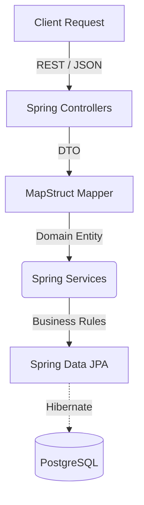

<h1 align="center">Inventory Management System (Enterprise Java)</h1>

<p align="center">
  
  
  
  
  
  
</p>

## 📖 Overview

A robust, enterprise-grade Inventory Management System built on the **Spring Boot** ecosystem. This project showcases deep knowledge of corporate backend standards, emphasizing data integrity, strict access control, and seamless mapping between data layers.

## 🏗️ Architecture & Design Patterns

The system employs a classic layered architecture pattern optimized for complex enterprise domains, ensuring business rules are strictly isolated from controllers and persistence details.

### Core Highlights
- **Layered Architecture:** Clear distinction between `Controllers`, `Services`, `Repositories`, and `Entities`.
- **DTO Mapping:** Utilizes `MapStruct` to automatically and safely map between domain Entities and Data Transfer Objects (DTOs), preventing internal models from leaking to the presentation layer.
- **Resilient Security:** Implements `Spring Security` to handle robust authentication and fine-grained authorization.
- **Database Abstraction:** Relies on `Spring Data JPA` backed by `PostgreSQL` to handle complex transactions and data persistence securely.
- **API Documentation:** Integrated with `SpringDoc / OpenAPI` for live, interactive documentation.



## 🚀 Getting Started

### Prerequisites
- Java Development Kit (JDK) 17
- Apache Maven
- Docker & Docker Compose

### Running locally
1. Clone the repository and navigate to the root directory.
2. Ensure you have a running PostgreSQL instance (or use the provided properties to point to your local DB).
3. Build the project using Maven:
```bash
./mvnw clean install
```
4. Start the application:
```bash
./mvnw spring-boot:run
```

Once running, the interactive OpenAPI documentation can be accessed directly at the root or swagger-ui endpoints provided in the application properties.

## 🧪 Testing
The project includes a suite of tests utilizing `Spring Boot Test` framework for both unit and integration verification.

```bash
# Run tests via Maven
./mvnw test
```
